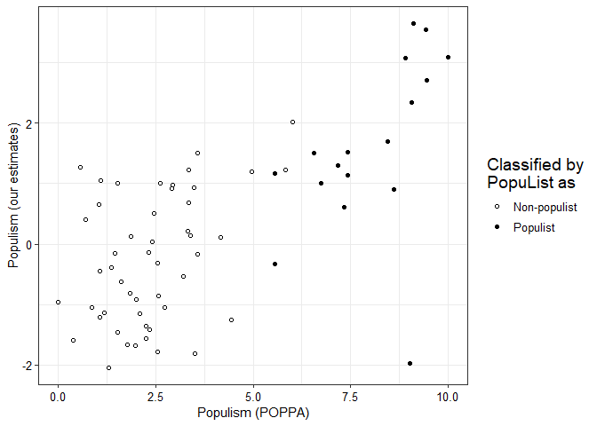
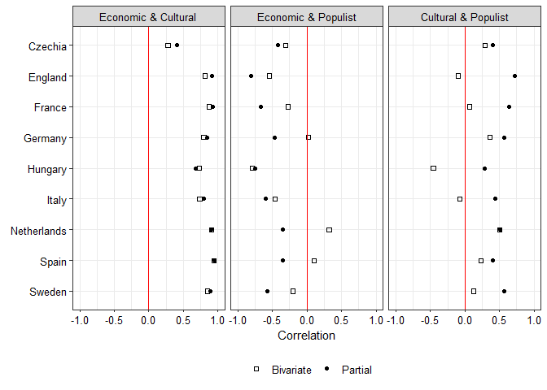
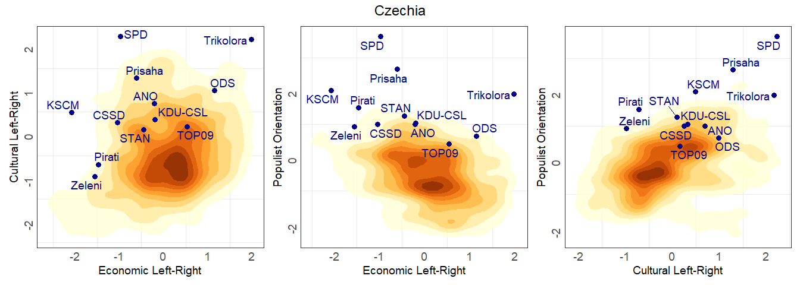
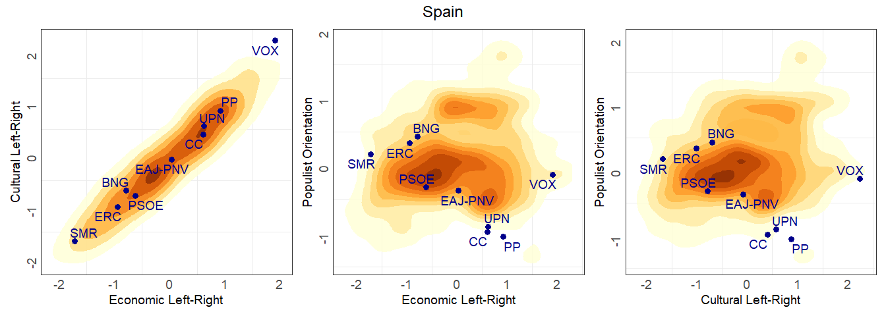
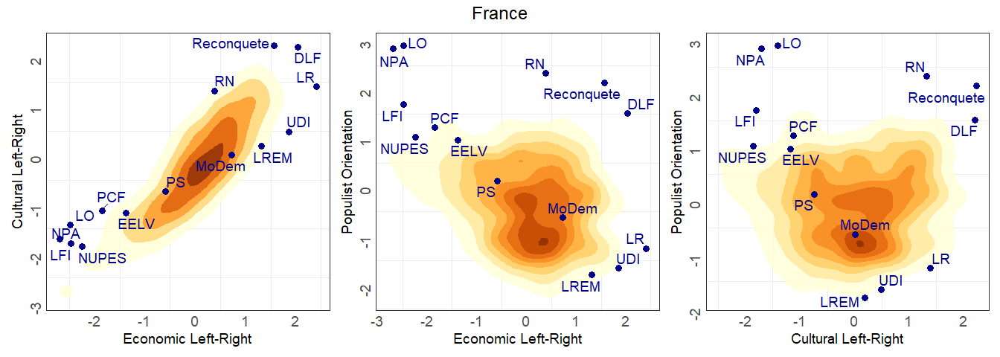
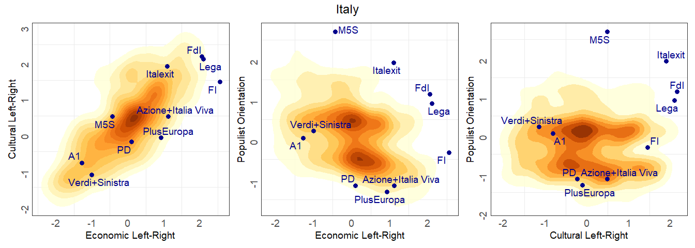

Populist Axis - Landscapes
================
AZ
2025-08-28

### Load the necessary packages and set options

``` r
library(ggplot2)
library(ggrepel)
library(patchwork)
library(dplyr)
```

    ## 
    ## Attaching package: 'dplyr'

    ## The following objects are masked from 'package:stats':
    ## 
    ##     filter, lag

    ## The following objects are masked from 'package:base':
    ## 
    ##     intersect, setdiff, setequal, union

``` r
library(tidyr)
library(countrycode)

set.seed(123)

theme_set(theme_bw() + theme(axis.title=element_text(size=11, color='black'), 
                             strip.text=element_text(size=10, color='black'),
                             axis.text=element_text(size=10, color='black'), 
                             legend.text=element_text(size=10, color='black'),
                             title=element_text(size=14, color='black')
                             ))
```

### Set constants

``` r
in_dir <- "./data"

names(countries) <- countries <- c("CZ","DE","ES","FR","HU","IT","NL","SE","GB")
udims <- c('econ','cult','populism')
countries.lab <- countrycode(countries, 'iso2c', 'country.name')
names(countries.lab) <- countries
countries.lab['GB'] <- 'England'
countries.lab <- sort(countries.lab)
```

### Load the data

``` r
loaded <- load(file= file.path(in_dir, "data_for_vcp.RData"))
```

### Check against published party-level populism scales

``` r
temp <- pdata |>
  mutate(
    populist = case_when(
      is.na(popul) ~ NA,
      grepl("^P",popul) ~ 'Populist',
      TRUE ~ 'Non-populist'
    )) 
temp |> 
  drop_na(populism, poppa_populism, populist) |>
  ggplot(aes(x=poppa_populism, y=populism, shape=populist)) +
  geom_point() +
  scale_shape_manual(values=c(1,16)) +
  labs(x="Populism (POPPA)", y='Populism (our estimates)', shape="Classified by\nPopuList as") 
```

<!-- -->

``` r
cat("correlation between POPPA measure and current measure: ", 
  with(temp, cor(poppa_populism, populism, use='complete.obs')),"\n")
```

    ## correlation between POPPA measure and current measure:  0.6666773

``` r
cat("excluding Hungary: ", 
with(subset(temp, cntry != 'HU'), cor(poppa_populism, populism, use='complete.obs')),"\n")
```

    ## excluding Hungary:  0.7629919

``` r
cat("by country:\n")  
```

    ## by country:

``` r
vs <- sapply(split(temp,temp$cntry), with,  cor(poppa_populism, populism, use='complete.obs'))
for (cn in names(vs)) cat(cn, ": ", vs[cn], "\n")
```

    ## CZ :  0.7856805 
    ## DE :  0.9372611 
    ## ES :  0.8847203 
    ## FR :  0.7864055 
    ## GB :  0.59042 
    ## HU :  -0.7886175 
    ## IT :  0.8404001 
    ## NL :  0.9416772 
    ## SE :  0.9050893

### Find correlations across dimensions

``` r
cors <- lapply(vdata, function(d) { 
  cov.wt(d[,udims], wt = d$wt, cor = TRUE, center = TRUE, 
         method = c("unbiased", "ML"))$cor 
})
```

### Find partial correlations

``` r
pcors <- lapply(cors, function(v) {
  prec <- solve(v)
  d <- sqrt(diag(prec))
  -prec / outer(d,d)
})
```

### Make a plot with correlations

``` r
stretch <- function(m) {
  m |> as.data.frame() |>
    tibble::rownames_to_column("l") |>
    pivot_longer(cols = any_of(udims), names_to="r") 
}
long_cors <- lapply(cors, stretch) |> bind_rows(.id="cntry") |> mutate(name="Bivariate")
long_pcors <- lapply(pcors, stretch) |> bind_rows(.id="cntry") |> mutate(name="Partial")

qlabs <- c('cor_econ_cult'='Economic & Cultural','cor_econ_populism'='Economic & Populist','cor_cult_populism'='Cultural & Populist')

rbind(long_cors, long_pcors) |>
  mutate(
    qty = paste0('cor_', l, "_", r),
    qty.f = factor(qty, levels=names(qlabs), labels=qlabs),
    cntry.f = factor(cntry, levels=rev(names(countries.lab)), labels=rev(countries.lab))
  ) |>
  filter(qty %in% names(qlabs)) |>
  ggplot(aes(x=value, y=cntry.f, shape=name)) +
  geom_point() +
  scale_shape_manual(breaks=c("Bivariate","Partial"), values=c(0,16)) +
  geom_vline(xintercept=0, color='red')+
  facet_wrap(vars(qty.f)) +
  labs(shape=element_blank(), x='Correlation', y=element_blank())+
  expand_limits(x=c(-1,1)) +
  theme(legend.position='bottom')
```

<!-- -->

### Landscapes

``` r
kde2d.weighted <- function(dat, w, n) {
  nx <- nrow(dat)
  gs <- lapply(dat, function(v) seq(min(v, na.rm=TRUE), max(v, na.rm=TRUE), length = n))
  hs <- sapply(dat, MASS::bandwidth.nrd) /4
  lik <- lapply(1:2, function(i) {
    a <- outer(gs[[i]], dat[[i]], "-")/hs[i]
    matrix(dnorm(a), n, nx)
  })
  if (missing(w)) w <- numeric(nx)+1
  z <- lik[[1L]] %*% diag(w) %*% t(lik[[2L]])/(sum(w) * hs[1L] * hs[2L])
  return(
    data.frame(
    x = rep(gs[[1L]], times = n),
    y = rep(gs[[1L]], each = n),
    den = as.vector(z) 
  ))
}

axes.template <- 
  list(c('x'='econ', 'y'='cult', 'z'='populism'),
       c('x'='econ', 'y'='populism', 'z'='cult'),
       c('x'='cult', 'y'='populism', 'z'='econ'))
axis.labs <- c('econ'='Economic Left-Right', 'cult'='Cultural Left-Right', 'populism'='Populist Orientation')
sdims <- names(axis.labs)
nb <- 100

for (cn in countries) {
  temp <- subset(vdata[[cn]], select=c('row','wt', sdims)) 
  ptemp <- subset(pdata, cntry==cn, select=c('cntry_party', 'party', sdims))
  pics <- list()
  for (a in seq_along(axes.template)) { 
    axes <- axes.template[[a]]
    kd.df <- kde2d.weighted(dat=temp[axes[c('x','y')]], n=nb, w=temp[['wt']])
    colnames(kd.df)[1:2] <- axes[c('x','y')]
    
    pics[[a]] <- ggplot(kd.df, mapping=aes(x=.data[[axes.template[[a]][['x']]]],
                                           y=.data[[axes.template[[a]][['y']]]])) +
      stat_contour(geom="polygon",aes(z = den, fill=after_stat(level)), alpha=0.8) +
      scale_fill_distiller(palette = "YlOrBr", direction = 1) +
      geom_point(data=ptemp, color="darkblue", size=3) +   
      geom_text_repel(data=ptemp, aes(label=party), color="darkblue", size=5) + 
      labs(x=axis.labs[axes.template[[a]]['x']], y=axis.labs[axes.template[[a]]['y']]) +
      theme_bw() + theme(legend.position = "none",
                         plot.caption=element_text(size=14),
                         axis.title.x=element_text(size=14), axis.title.y=element_text(size=14),
                         axis.ticks=element_blank(),  axis.text.x=element_text(size=14),  
                         axis.text.y=element_text(size=14, angle=90),
                         panel.grid.minor=element_line(), panel.grid.major=element_blank())
  }
  print(wrap_plots(pics[[1L]], pics[[2L]], pics[[3L]], nrow=1L) +
    plot_annotation(countries.lab[cn], theme=theme(plot.title=element_text(hjust=0.5, size=18))) +
    plot_layout(widths = c(4, 4, 4)))
} 
```

<!-- --><!-- --><!-- --><!-- -->

    ## Warning: ggrepel: 3 unlabeled data points (too many overlaps). Consider
    ## increasing max.overlaps

<!-- --><!-- --><!-- --><!-- --><!-- -->
