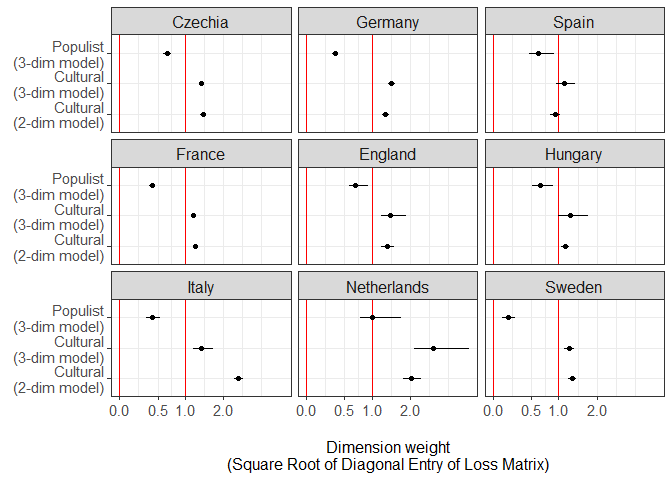
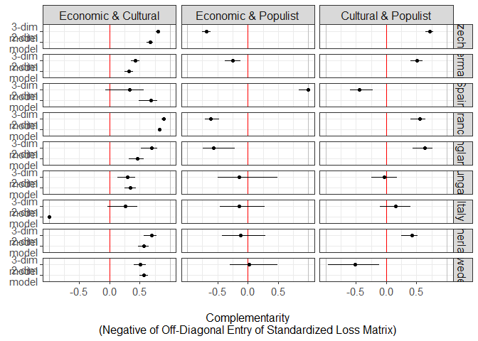
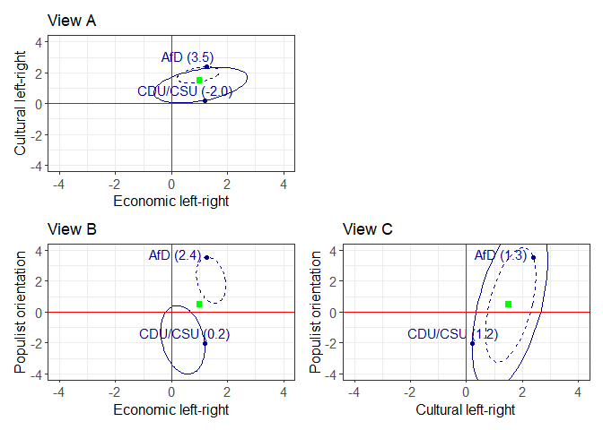

Populist Axis - Characterizing Dimensions
================
AZ
2025-08-25

### Load the necessary packages and set options

### Preliminary things

Define subdirectories and other constants

``` r
in_dir <- "./data"
outdir <- "./output"
countries <- c("CZ","DE","ES","FR","HU","IT","NL","SE","GB")
names(countries) <- countries

countries.lab <- countrycode::countrycode(countries, 'iso2c', 'country.name')
names(countries.lab) <- countries
countries.lab['GB'] <- 'England'
countries.lab <- sort(countries.lab)
sdims <- c('econ', 'cult', 'populism') 
```

Load useful functions

``` r
Rcpp::sourceCpp("src/misc.cpp")
```

Load data and estimates

``` r
loaded <-  load(file.path(in_dir, "data_for_vcp_EVES2.RData"))
est <- readRDS(file.path(outdir, "estimates_w_intercepts_r.rds"))
```

### Plot dimension weights and complementarity

Select the models for the display

``` r
names(touse) <- touse <- grep("^M.4", names(est), val=TRUE)
```

Calculate the relevant quantities with confidence intervals

``` r
# entries of a loss matrix and labs
w_labs <- c('w_econ'=1,'w_cult'=2,'w_pop'=3)
temp <- matrix(1:9, 3,3)
cor_labs <- c('cor_econ_cult'=temp[2,1],
              'cor_econ_pop'=temp[3,1],
              'cor_cult_pop'=temp[3,2])
 
bulk  <- lapply(touse, function(m) {
  e <- est[[m]]
  if (substr(m,2,2)=='A') {
    nd <- 3
    w_labs_this <- w_labs
    cor_labs_this <- cor_labs
  } else {
    nd <- 2
    w_labs_this <- w_labs[c("w_econ","w_cult")]
    cor_labs_this <- cor_labs['cor_econ_cult']   
  }
  co <- e@coef
  vc <- e@vcov
  text <- grep("^lambda", names(co), val=TRUE)
  sorter <- regmatches(text, gregexpr("\\d+\\.?\\d*", text)) |> as.integer() 
  nam <- text[order(sorter)]
# simulations  
  sim <- tryCatch(MASS::mvrnorm(n=1000, mu=co[nam], Sigma=vc[nam,nam]), error=function(e) return(NULL))
  if (is.null(sim)) return(NULL)
# stack the point estimate on top of the simulated estimates
  sim <- rbind(co[nam], sim)   
  ele <-  apply(sim, 1L, function(r) {
    psi <- build_psi(r, nd)
    psi <- psi/psi[1L,1L]
    w <- sqrt(diag(psi))
    R <- diag(1/w)
    psi.hat <- -R %*% psi %*% R
    c(w,psi.hat[cor_labs_this])
  })
  estim <- ele[,1L]
  lb <- apply(ele[,2:ncol(ele)], 1L, quantile, prob=0.025)
  ub <- apply(ele[,2:ncol(ele)], 1L, quantile, prob=0.975) 
  data.frame(cntry=substring(m, 5L,6L), 
             vb=ifelse(substring(m, 1L,1L)=='M','raw','projected'),
             model=substring(m, 2L,3L),
             quantity = c(names(w_labs_this), names(cor_labs_this)),
             est=estim, lb=lb, ub=ub)
}) |> bind_rows()
```

Plot the weights of the cultural and populist dimensions (relative to
the weight of the economic dimension, which is set to 1)

``` r
bulk |>
  filter(model %in% c('A4','C4') & vb=="raw") |>
  filter(quantity %in% c('w_cult','w_pop')) |> 
  mutate(
    dim = case_match(
      substring(model, 1L, 1L),
      'A' ~ '3-dim', 'C' ~ '2-dim' 
    ),
    loc = paste0(ifelse(quantity=='w_cult','Cultural','Populist'), "\n(", dim," model)") 
  ) |> ggplot(aes(y=loc)) +  
  geom_vline(xintercept=0, color='red') +
  geom_vline(xintercept=1, color='red') + 
  geom_point(aes(x=est)) +
  geom_linerange(aes(xmin=lb, xmax=ub)) +
  facet_wrap(vars(cntry), labeller=labeller(cntry=countries.lab), nrow=3) + 
  scale_x_continuous(breaks=c(0, 0.5,1,2), trans="log1p")+
  labs(x="\nDimension weight\n(Square Root of Diagonal Entry of Loss Matrix)", y=element_blank(), shape='Coordinates', linetype='Coordinates') +
  theme(legend.position='bottom') 
```

<!-- -->

Plot the complementarities

``` r
qlabs <- c('cor_econ_cult'='Economic & Cultural','cor_econ_pop'='Economic & Populist',
           'cor_cult_pop'='Cultural & Populist')
bulk |>
  filter(model %in% c('A4','C4') & vb=="raw") |>
  filter(quantity %in% c('cor_econ_cult','cor_econ_pop','cor_cult_pop')) |>
  mutate(
    dim = case_match(
      substring(model, 1L, 1L),
      'A' ~ '3-dim\nmodel', 'C' ~ '2-dim\nmodel' 
    ),
    nest = est,
    nlb = lb,
    nub = ub,
    qty.f = factor(quantity, levels=names(qlabs),
                   labels = qlabs)
  ) |>  ggplot(aes(y=dim)) + 
  geom_vline(xintercept=-1, color='gray') + 
  geom_vline(xintercept=0, color='red') +
  geom_vline(xintercept=1, color='gray') +
  geom_point(aes(x=nest)) +
  geom_linerange(aes(xmin=nlb, xmax=nub)) +
  scale_x_continuous(breaks=c(-0.5,0,0.5))+
  facet_grid(cntry ~ qty.f, scales='free', 
             labeller=labeller(cntry=countries.lab)) +
  labs(x='\nComplementarity\n(Negative of Off-Diagonal Entry of Standardized Loss Matrix)', y=element_blank()) +
  theme(legend.position='bottom')
```

<!-- -->

### Construct and plot indifference curves for the German case

Compute loss matrices for the model with control variables

``` r
cntry.model <- grep("^MA4", touse, val=TRUE)
names(cntry.model) <- substring(cntry.model, 5L)

loss_matrix  <- lapply(cntry.model, function(m) {
  mod <- est[[m]]
  co <- mod@coef
  text <- grep("^lambda", names(co), val=TRUE)
  sorter <- regmatches(text, gregexpr("\\d+\\.?\\d*", text)) |> as.integer() 
  lam <- co[text[order(sorter)]]
  build_psi(lam, 3) 
})
```

Illustrations with indifference curves and specific parties

``` r
axis.labs <- c('econ'='Economic left-right', 'cult'='Cultural left-right', 'populism'='Populist orientation')
axes.template <- 
  list(c('x'='econ', 'y'='cult', 'z'='populism'),
       c('x'='econ', 'y'='populism', 'z'='cult'),
       c('x'='cult', 'y'='populism', 'z'='econ'))

### make illustrations with the indifference curves in the German case
design <- "
  1#
  23
"
names(p) <- p <- c('AfD','CDU/CSU')
M <- loss_matrix[["DE"]]
M <- M/max(diag(M))

## permutations (named after the hidden dimension)
M.li <- list(
  'populism' = M,
  'cult' = M[c(1,3,2),c(1,3,2)],
  'econ' = M[c(2,3,1),c(2,3,1)]
)

## coordinates
voters <- data.frame(
  type.v=c('rpop','cen'),
  econ.v=c(1,0.6),
  cult.v=c(1.5,0.4),
  populism.v=c(0.5,-0.1)
)

examples <- pdata |> filter(cntry=='DE' & party %in% c('AfD','CDU/CSU')) |>
  select(party, any_of(sdims)) |>
  cross_join(voters)

## squared distances
sdims.v <- paste0(sdims,'.v')
examples$squt <- apply(examples[c(sdims, sdims.v)], 1L, function(r) {
  dif <- r[sdims]-r[paste0(sdims,'.v')]
  t(dif) %*% M %*% dif 
})

## calculate indifference curves
curves_list <- list()
for (a in seq_along(axes.template)) { 
  axes <- axes.template[[a]]
  M_this <- M.li[[axes['z']]]
  f0 <- M_this[3L,3L]
  f1 <- M_this[1:2,3L]
  om <- M_this[1:2, 1:2]
  iom <- solve(om)
  iu <- solve(chol(om))
  for (r in 1:nrow(examples)) {
    pos.v <- simplify2array(examples[r,paste0(axes,'.v')])
    pos <- simplify2array(examples[r,axes])
    z <- pos[3L] - pos.v[3L]
    names(z) <- NULL
    rad <- sqrt(examples$squt[r] - z^2*f0 + z^2*(t(f1) %*% iom %*% f1))[1L,1L]
    points <- data.frame(t = seq(0,2*pi,length.out=100)) |>
      mutate(
        x = rad*cos(t),
        y = rad*sin(t)
      ) |> 
      select(x,y) |> 
      as.matrix()
    points_proj <- points %*% t(iu)
    shift <- pos.v[1:2]-z*iom %*% f1
    npoints.df <- sweep(points_proj, 2L, shift, '+') |> as.data.frame()
    colnames(npoints.df) <- c('x','y')
    curves_list[[paste0(a,":",r)]] <- npoints.df |>
      mutate(
        rad = rad,
        party = examples$party[r],
        type.v = examples$type.v[r],
        ori = a
      )
  }
}
curves <- do.call('rbind', curves_list) 
```

Make plots

``` r
pics <- list()
flabs <- paste0("View ", LETTERS[seq_along(axes.template)])
for (a in seq_along(axes.template)) {
  pics[[a]] <- list()
  xnam <- axes.template[[a]]['x']
  ynam <- axes.template[[a]]['y']
  znam <- axes.template[[a]]['z']
  for (t in unique(examples$type.v)) {
    pics[[a]][[t]] <- examples |>
      filter(type.v==t) |>
      mutate(
        plab = paste0(party, ' (',formatC(.data[[znam]], digits=1, format='f'),')') 
      ) |> ggplot() +
      geom_path(data=subset(curves, ori==a & type.v==t), 
                aes(x=x, y=y, group=party, linetype=party),
                color='darkblue') +
      geom_point(aes(x=.data[[paste0(xnam,'.v')]], y=.data[[paste0(ynam,'.v')]]),
                 color="green", shape=15, size=2) +
      geom_point(aes(x=.data[[xnam]], y=.data[[ynam]]),
                 color='darkblue') + 
      geom_text_repel(aes(x=.data[[xnam]], y=.data[[ynam]], label=plab),
                      color='darkblue', nudge_x=-0.1, nudge_y=0.1) + 
      expand_limits(x=0,y=0) +
      geom_hline(yintercept=0, color='red') +
      geom_vline(xintercept=0, color='red') +  
      coord_cartesian(xlim =c(-4,4), ylim = c(-4,4)) +
      scale_linetype_manual(breaks=c('AfD','CDU/CSU'), values=c("dashed","solid")) +
      labs(x=axis.labs[xnam], y=axis.labs[ynam], title=flabs[a]) +
      theme(legend.position="none")
  }
}
pics[[1L]][['rpop']] + pics[[2L]][['rpop']] +  pics[[3L]][['rpop']] +
  plot_layout(design = design, guides="collect") & theme(legend.position = 'none')
```

<!-- -->
